= Görüntüde Gölge Yumuşatma

== 1) İçindekiler
. İçindekiler
. Versiyon Geçmişi
. Giriş
. Sayısal Görüntü ve Görüntü İşlemeNedir?
.. Görüntü İşleme Nedir?
.. Görüntü İşleme ile Gölge Tespiti
. Bayesian Sınıflandırma ile Gölge Tespiti
.. Bayesian Sınıflandırma
.. Python ile Bayesian Sınıflandırmanın Görüntüye Uygulanması
.. Sonuçlar
. Otsu Eşikleme Metodu ile Gölge Tespiti
.. Otsu Eşikleme Metodu
.. Python ile Otsu Eşikleme Metodunun Görüntüye Uygulanması
.. Sonuçlar
. Histogram Aralığı ile Gölge Tespiti
.. Histogram Nedir?
.. Histogram Aralığı Nasıl Tespit Edilir?
.. Python ile Histogram Aralığının Görüntüye Uygulanması
.. Sonuçlar
. Referanslar

== 2) Versiyon Geçmişi

|===
|Tarih|Değişiklik|Kişi

|10.01.2017
|Görüntüde Gölge Tespiti

|Gönül TOKTAY
|10.01.2017
 
|Görüntüde Gölge Tespiti
|M.Sıla Genç

|02.02.2017

|Düzenleme
|Merve Tafralı

|===

== 3) Giriş

== 4)Sayısal Görüntü ve Görüntü İşleme Nedir?

=== 4.1) Görüntü İşleme Nedir?

Gerçek yaşamda, bir görüntü veya resim basit 2 değişkenin bir fonksiyonu olarak tanımlanır. ω a(x,y) gibi bir fonksiyonla ifade edilen bir resimde a bir şiddet birimi( örneğin parlaklık) ve x ve y değişkenleri ise resmin gerçek koordinatlarıdır.[1] +
Dijital görüntü sayısal değerlerden oluşur. ω 1 ve 0’lardan oluşan sayısal görüntü yapımız a[m,n], 2 boyutlu dünyadan elde edilen a(x,y) fonksiyonundan örnekleme tekniği kullanılarak oluşturulur.

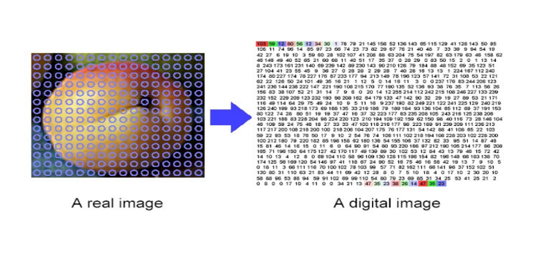

Sayısal bir görüntü M ve N sayılarında satır ve sütünlardan oluşur ve satır ve sütünların kesiştiği her bölgeye pixel denir. ω O piksel’deki değer ise derinlik (z) , renk(λ) ve zamanın(t) bir fonksiyonudur. +
Dijital bir resim haline getirilmiş olan gerçek yaşamdaki görüntülerin, bir girdi resim olarak işlenerek, o resmin özelliklerinin ve görüntüsünün değiştirilmesi sonucunda yeni bir resmin oluşturulmasıdır.[1] +
Görüntüler genellikle analog ortamlardan dijital ortamlara geçirildiği için bozukluk içerir. Bozukluklar gürültü olarak da ifade edilirler. Gürültüler görüntü üzerinde istenmeyen sinyallerdir. Görüntü işleme bu hataları  düzeltmek için kullanılabilir.Görüntü işleme bnun dışında farklı alanlarda da kullanılabilmektedir. +

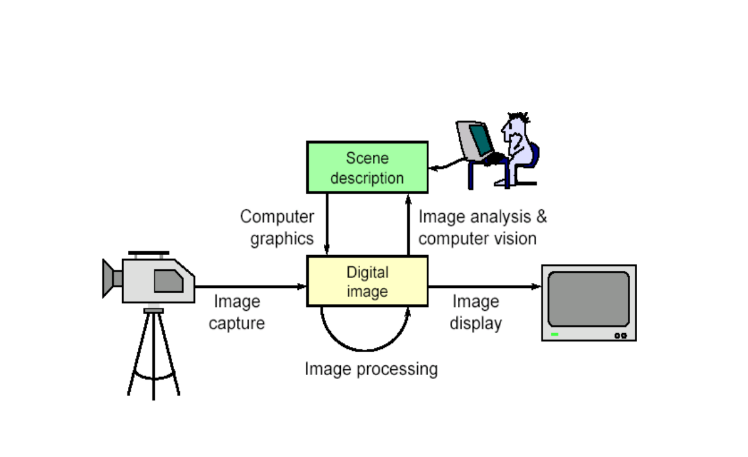

=== 4.2)Görüntü İşleme ile Gölge Tespiti
Görüntülerdeki gölgeler,görüntü kalitesinin azalmasına sebep olmaktadır. Bu sebepten ötürü gölgelerin belirlenerek yumuşatılması gerekebilmektedir. Gölgenin belirlenmesi için Bayesian sınıflandırma algoritmasından yararlanılacaktır. Sınıflandırma algoritması görüntü işleme kapsamında Python programlama kullanılarak örneklenmeye çalışılacaktır.

== 5)Bayesian Sınıflandırması
Sınıflandırmanın genel amacı bir nitelik değerini,diğerlerini kullanarak belirlemektir. Veri dağılımına göre bir model elde edilir. Elde edilen bu model başarımı belirlendikten sonra niteliğin bilinmeyen değerini tahmin etmek için kullanılır. +
Bayes sınıflandırmasında; 
* Niteliklerin hepsi aynı derecede önem sahibi
* Nitelikler birbirlerinden bağımsızdır; yani bir nitelik değeri diğer bir nitelik değeri hakkında bilgi içermemektedir.
Çalışmada kullanılacak sınıflandırma renkler üzerinden gerçekleştirilecektir. Piksel değerinin gölge olarak nitelendirilmesi için o pikselin ve  genel görüntü üzerinde yapılacak olasılık işlemlerinin sonuçlarına göre karar verilecektir. +

=== 5.1)  Python ile Bayesian Sınıflandırmanın Görüntüye Uygulanması

[source,python]
---------------------------------------------------------------------

from PIL import Image           #PIL modülünden IMAGE kütüphanesini uygulamamıza dahil ediyoruz.

image=Image.open("image.jpg")       #image değişkeninin içerisine proje klasörümüzde bulunan 'image' adlı resim dosyasını atıyoruz.
newmat = image.load()           #newmat adlı yeni bir matris oluşturup bunun içerisine resim dosyamızı yüklüyoruz.
wdh=image.size[0]           #wgh değişkenine resim dosyasının genişlik boyutunu atıyoruz. Dosyamızın genişliği 640 piksel.
hgh=image.size[1]           #hgh değişkenine resim dosyasının yükseklik boyutunu atıyoruz. Dosyamızın yüksekliği 360 piksel.
shapelist=[[0]*hgh for x in range(wdh)]     #Bayes sınıflandırmada kullanılacak listeler bulunacaktır. Bunlardan biri de gölge piksellerinin tutulacağı shapelist olacaktır.
r_list=[[0]*hgh for x in range(wdh)]        #Görüntüde bulunan her renk için bir liste tutulacaktır. Daha sonra bu renkler karşılaştırılacaktır. Olasılıkları hepsalanıp bayes sınıflandırması yapılacaktır.
g_list=[[0]*hgh for x in range(wdh)]        #Yeşil renk sınıfını tutan liste.
b_list=[[0]*hgh for x in range(wdh)]        #Mavi renk sınıfını tutan liste.
for i in range(wdh):        #İç içe döngü ile görüntünün piksel renk kodları çekilir.
    for j in range(hgh):
        r, g, b = image.getpixel((i, j))        #Resimde bulunan her piksele ait r,g,b renk kodları getpiksel fonksiyonu ile alınır.
        r_list[i][j]=r          #Alınan her derğer kendi listesine kaydedilir.
        g_list[i][j]=g
        b_list[i][j]=b
hist_r=[0]*256      #Olasılık hesaplamasında kullanılacak olan histogramalr hazırlanır. Olasılık için bize gerekli olan frekans hesabını histogram ile gerçekleştirdiğimizden her renk kodu için ayrı bir histogram tutulacaktır.
hist_g=[0]*256      #g_list için tutulan histogram.
hist_b=[0]*256      #b_list için tutulan histogram.
for m in range(wdh):        #Listeler içerisinde girip her listenin histogramını belirlememiz gereklidir. Bunun için iç içe döngüler kullanıyoruz.
    for n in range(hgh):
        a=r_list[m][n]          #Her tuttuğumuz listenin piksel değerini alıp bunu sırasıyla değişkenlerde tutuyoruz.
        b=g_list[m][n]  
        c=b_list[m][n]
        hist_r[a]=hist_r[a]+1   #Histogram değerleri için bulduğumuz değişkenleri bir arttırarak topluyoruz.
        hist_g[b]=hist_g[b]+1
        hist_b[c]=hist_b[c]+1
sum_r, sum_g, sum_b = 0, 0, 0       #Tüm histogram değerlerinin toplandığı sum değişkenleri tanımlandı.
for p in range (len(hist_r)-1):     #Kırmızı renk histogramının tüm değerleri indisi ile çarpılıp toplanır.
    sum_r=(hist_r[p]*p)+sum_r   
for p in range (len(hist_g)-1):     #Yeşil renk histogramının tüm değerleri indisi ile çarpılıp toplanır.
    sum_g=(hist_g[p]*p)+sum_g
for p in range (len(hist_b)-1):     #Mavi renk histogramının tüm değerleri indisi ile çarpılıp toplanır.
    sum_b=(hist_b[p]*p)+sum_b
mean_r=sum_r/(wdh*hgh)      #Olasılıkların hesaplanması için tüm toplama boyut bölünür ve ortalama değer hesaplanır.
mean_g=sum_g/(wdh*hgh)
mean_b=sum_b/(wdh*hgh)
poseb2=(float(hist_r[mean_r])/(hist_r[mean_r]       #Formülden ilk olasılık değeri hesaplanır.
             +hist_g[mean_g]
             +hist_b[mean_b]))*(float(hist_g[mean_g])/(hist_r[mean_r]
             +hist_g[mean_g]+hist_b[mean_b]))*(float(hist_b[mean_b])/(hist_r[mean_r]
             +hist_g[mean_g]+hist_b[mean_b]))
for x in range(wdh):            #İkinci olasılık hesabı ve bu hesaba göre görüntünün değerinin hesaplanması için iç içe döngü oluşturuldu.
    for y in range(hgh):
        poseb1=(hist_r[r_list[x][y]]/(hist_r[r_list[x][y]]      #Formülden ikinci olasılık değeri hesaplanır.
               +hist_b[b_list[x][y]]
               +hist_g[g_list[x][y]]+0.01))*(hist_g[g_list[x][y]]/(hist_r[r_list[x][y]]
               +hist_b[b_list[x][y]]
               +hist_g[g_list[x][y]]+0.01))*(hist_b[b_list[x][y]]/(hist_r[r_list[x][y]]
               +hist_b[b_list[x][y]]
               +hist_g[g_list[x][y]]+0.01))
        if(poseb1>poseb2):          #Listeler arası ortalama değer eğer daha büyükse histogram değerlerine göre görüntünün o bölgesine beyaz renk verilir.
            shapelist[x][y]=1
            newmat[x,y]=(255,255,255)
        else:           #Değilse siyah renk atılır.
            shapelist[x][y]=0
            newmat[x,y]=(0,0,0)
image.save("bayes.bmp")     #Görüntünün son hali proje klasörüne kaydedilir.
---------------------------------------------------------------------

== 6)OTSU EŞİKLEME

Siyah beyaz görüntüler görüntü üzerinde belirli dizilerin ya da şekillerin arandığı uygulamalarda işlem yükünü hafifletmek veya görüntü üzerinde mantıksal işlemleri hızlandırmak için kullanılırlar. Adını metodu geliştiren Nobuyuki Otsu’dan almıştır. Normalde bir gri görüntüyü ikili biçime çevirmek için izlenecek yöntem oldukça basittir. Bir eşik değeri belirlenir ve bu eşik değerin üzerindeki renkler beyaza, altındaki renkler siyaha dönüştürülür. Ancak tüm görüntüler aynı niteliklere sahip değildir. Sabit bir eşik değeri tüm görüntüler üzerinde kabul edilebilir sonuçlar üretemeyebilir. Dolayısıyla eşik değerin, resmin renk dağılımına uygun olarak belirlenmesini sağlayacak bir yönteme ihtiyaç duyulur. +

Otsu metodu, gri seviye görüntüler üzerinde uygulanabilen bir eşik tespit yöntemidir. Gri tonlarda olan bir görüntü 0-255 arasında seçilecek olan bir T eşik değerine göre siyah beyaz görüntü oluşturulur. Bu işlem kısaca şu şekilde gösterilir: +

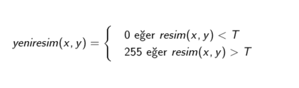

Önemli olan nokta T değerinin doğru seçilmesidir. T değeri olması gerekenden büyük seçilirse, oluşturulacak olan yeni görüntüde gereğinden fazla beyaz piksel oluşacaktır. Küçük seçilirse de siyah pikseller fazla olmuş olacaktır.Seçilecek olan eşit değeri deneme yoluyla binlerce piksel için mümkün olmamaktadır. Bunun üzerine kullanılacak olan görüntü için eşik değerini hesaplayan algoritma Nobuyuki Otsu tarafından geliştirilmiştir. Geliştirilen otsu metodu eşik değerini görüntü üzerinden hesaplamaktadır. +

Gri tonlu görüntüler üzerinde çalışmakta olduğunu belirtmiştik. Sadece renklerin görüntü üzerinde kaçar defa bulunduğuna bakarak hesaplamaları yapar. Bu yüzden önce görüntünün renk histogramı hesaplanır ve tüm işlemler histogram dizisi üzerinde yapılır. +

*Histogram*: Bir resimdeki renk değerlerinin sayılarını gösteren grafiktir. +

Otsu metodu kullanılırken görüntünün arka plan ve ön plan olmak üzere 2 renk sınıfı olduğu düşünülür. Bütün eşik değerleri için renk sınıflarının varyans hesaplaması yapılır. Varyans değerinin en küçük olmasını sağlayan değer, optimum eşik değeri olarak kabul edilir. Amaç iki sınıf arasındaki varyans değerinin maximum olmasını sağlayacak değerin bulunmasıdır. +

*Varyans*: Dizi elemanlarının dizi ortalamasına olan uzaklıklarının karelerinin ortalamasıdır. Bu değer; dizi içinde var olan elemanların ortalamaya ne kadar yakın olduklarını gösterir. Varyans hesaplama formülü: +

image::4.png[4]

Verilen formülde Pr{Xi}  ifadesi Xi değerinin gelme olaslığıdır.  Düzgün dağılımlı N boyutlu dizi için bu değer 1/N dir.  MxN lik görüntü için ise bu değer; histogram dizisi hesaplandıktan sonra i tonunun gelme olasılığı histogram[i]/(MxN )’dir. +
Sınıflar arası varyans; +

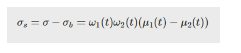

Formülü ile hesaplanır. +
W değişkenleri→ sınıf yoğunlukları	µ değişkenleri→ağırlıklı sınıf ortalamaları +
olarak ifade edilmektedir. +

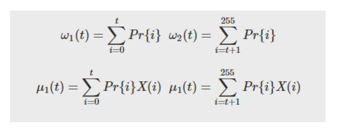

X(i) nin i. Renk seviyesi yukarıdaki formüllerle hesaplanmaktadır. +
Anlaşılır olması açısından aşağıdaki örneği inceleyelim: +

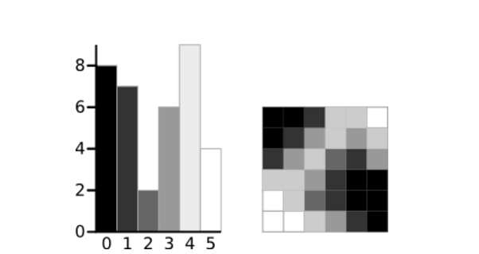

Yanda gösterilmiş olan şekilde gri tonlamaları olan bir görüntünün 6 kısımdan oluşturulmuş histogramı bulunmaktadır. +

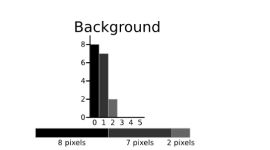

Arka plan renk sınıfının değerleri hesaplanacaktır:

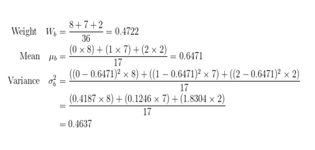

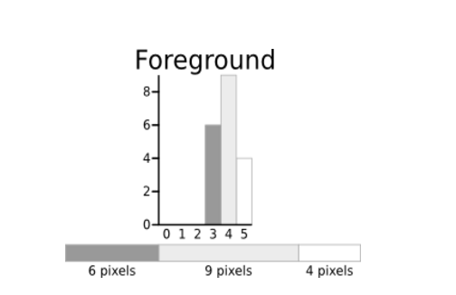

Aynı işlem ön plan renk sınıfı için tekrarlanır:

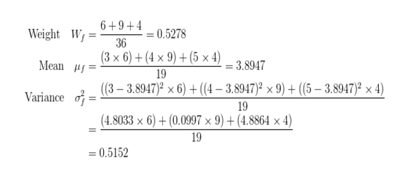

Elde edilen değerler sonucu sınıf varyansı:

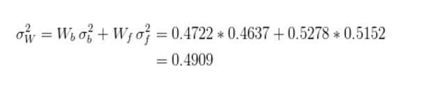

=== 6.2)Python ile Otsu Yönteminin Uygulama Örneği

[source,python]
---------------------------------------------------------------------

from PIL import Image           

#PIL modülünden IMAGE kütüphanesini uygulamamıza dahil ediyoruz.

image=Image.open("image.jpg")      

#image değişkeninin içerisine proje klasörümüzde bulunan 'image' adlı resim dosyasını atıyoruz.

newmat = image.load()          

#newmat adlı yeni bir matris oluşturup bunun içerisine resim dosyamızı yüklüyoruz.

wdh=image.size[0]           

#wgh değişkenine resim dosyasının genişlik boyutunu atıyoruz. Dosyamızın genişliği 640 piksel.

hgh=image.size[1]           

#hgh değişkenine resim dosyasının yükseklik boyutunu atıyoruz. Dosyamızın yüksekliği 360 piksel

graylist=[[0]*hgh for x in range(wdh)]  

#graylist adında tanımladığımız matrisin boyutunu yukarıda aldığımız resim dosyamızın genişlik ve yükseklik değerlerine göre belirliyoruz.

for x in range(wdh):       

#Otsu metodu gri seviye görüntüler üzerinde çalıştığı için resim dosyamızı gri tonlarına çevirmek için iç içe döngü ile matrise çekiyoruz. Böylece her bir piksel birer matris elemanı olacaktır. 

    for y in range(hgh):
        r, g, b = image.getpixel((x, y))        
        
        #Her pikselde birer r(kırmızı),g(yeşil),b(mavi) değeri bulunmaktadır. Bunlar o piksele renk veren kodlardır. Öncelikle 'getpixel' fonksiyonu ile bu değerleri r,g,b değişkenlerine atıyoruz. 
        
        gray=(int)((r*0.2126)+(g*0.7152)+(b*0.0722))        
        
        #Resimizi gri yapacak olan sayısal değeri elde etmek için, insan gözünün gama ışınlarını algılama oranlarına göre oluşturulan formül ile aldığımız katsayıları r,g,b değişkenleriyle çarpıp topluyoruz. Böylece resimdeki her piksel için ayrı bir gri renk tonu elde etmiş oluyoruz.
        
        graylist[x][y]=gray         
        
        #graylist matrisinin her elemanına ağırlık toplama yöntemi ile bulduğumuz gri değerini kaydediyoruz.
        
        newmat[x,y]=(gray,gray,gray)            
        
        #Resim dosyasını yüklediğimiz matrisin tüm elemanlarına(piksellerine) ağırlık toplama yöntemine göre bulduğumuz gri renk kodunu atıyoruz. Böylece resmin her pikseli renk tonuna göre gri rengini almış olacaktır. Burada kırmızı, yeşil, mavi renk tonlarının hepsine aynı değeri atıyoruz. Bu yöntem gri rengini elde etmemizi sağlıyor.
        
image.save("new.bmp")       

#Artık gri tonlarında olan resmi proje dosyasının içine .bmp uzantılı olarak kaydediyoruz.

def histogram(image):       

#Histogram fonksiyonunu renklerin görüntü üzerindeki sayısını bulmak için kullanacağız. Bu metod bir image parametresi ile çalışmaktadır.

    width = image.size[0]       
    
    #Parametre olarak aldığımız image dosyasının ilk elemanı olan genişlik boyutunu 'width' değişkenine atıyoruz.
    height = image.size[1]     
    
    #Parametre olarak aldığımız image dosyasının ikinci elemanı olan yükseklik boyutunu 'height' değişkenine atıyoruz.
    
    histogram=[0]*256            
    
    #histogram adında bir matris tanımlıyoruz. Bu matris renk sayılarını tutacağımız grafiktir.
    
    for x in range(height):     
    
    #Görüntünün tüm piksellerini yani matrisimizin elemanlarını dolaşmak için genişlik ve yükseklik değerleriyle iç içe döngü kullanıyoruz.
        for y in range(width):
            a,b,c=image.getpixel((y,x))     
            
            #image değişkeninin her pikselinde bulunan sayısal değerleri çekip a,b,c değişkenine atıyoruz. Burada gelen değer örnek olarak :(200,200,200) şeklindedir. Çünkü ağırlık toplama yönteminden sonra her pikselde aynı sayısal değer yani aynı tonlar bulunuyordu.
            
            histogram[a]=histogram[a]+1       
            
            #Bulduğumuz üç değerden herhangi birini kullanarak histogramda topladığımız renk sayısını bir arttırıyoruz.
    return histogram     
    
    #Geri dönüş değeri olan histogramda iç içe döngülerin sonucunda resmin üzerinde bulunan her pikseldeki renk tonunu ayrı ayrı tutmuş olduk.

def Otsu(image):       

#Otsu algoritmasını kullancağımız fonksiyon. 'otsu_thrd' adlı metodumuz image parametresi ile çalıştırılmaktadır.
    hist=histogram(image)       
    
    #Otsu metodunun en önemli özelliği olan histogram yani renk sayısını bulmak için ilk olarak parametremiz olan 'image' değişkenini histogram fonksiyonuna gönderiyoruz. Geri dönen matris değerini 'hist' adında bir matrise atıyoruz.
    
    sum_all=0           
    
    #'sum_all' adlı değişkenini toplam indis sayısını tutmak için tanımladık. İlk değer olarak '0' atadık.
    
    for t in range(256):    
    
    #Histogramdan gelen matris indislerindeki toplam değeri almak için döngü oluşturuyoruz.
    
        sum_all+=t*hist[t]
        
    sum_back = 0   
    
    #Kendisi ve kendisinden önceki indisteki elemanların değerler toplamını tutacak değişken.
    
    w_back = 0     
    
    #Bulduğumuz eşik değerinden önceki değerler için weight değerini tutacak değişken.
    
    w_fore = 0       
   
   #Bulduğumuz eşik değerinden sonraki değerler için weight değerini tutacak değişken.
    
    mean_back = 0  
   
   #Bulduğumuz eşik değerinden önceki değerler için mean değerini tutacak değişken.
    
    mean_fore = 0  
   
   #Bulduğumuz eşik değerinden sonraki değerler için mean değerini tutacak değişken.
    
    var_max = 0       
   
   #Histogram elemanları arasındaki en yüksek varyans değerini tutacak değişken.
    
    var_between = 0    
   
   #Histogramdaki her renk tonu için sınıflar arası varyans değerini tutacak değişken.
    
    threshold = 0     
   
   #Threshold işlemini yapacak olan yani otsu metodunun asıl amacı olan eşik değerini tutacak değişken.
    
    total = image.size[0]*image.size[1]    
    
    #'total' değişkeninde görüntünün genişlik*yükseklik değerleri yani toplam alanı bulunmaktadır.
    
    for t in range(256):    
    
    #Histogram üzerindeki tüm değerleri ulaşmak için döngü oluşturuyoruz.
    
        w_back += hist[t]   
        
        #Eşik değerinden önceki tüm değerleri sırasıyla 'w_back' değişkeninde topluyoruz.
        
        if (w_back == 0):   
        
        #Mean değerini hesaplarken paydada kullancağımız 'w_back' değerinin 0 olması durumunu kontrol ediyoruz. 0 ise döngüde sıradaki değer ile devam edilir.
        
            continue
        
        w_fore = total - w_back     
        
        #Eşik değerinden sonraki weight değerleri bulmak için toplam değerinden bulduğumuz önceki weight değerlerini çıkarıyoruz.
        
        if (w_fore == 0) :  
        
        #Mean değerini hesaplarken paydada kullancağımız 'w_fore' değerinin 0 olması durumunu kontrol ediyoruz. 0 ise döngüde sıradaki değer ile devam edilir.
        
            continue
        
        sum_back += t * hist[t]     
        
        #Histogramda kendisi ve kendisinden önceki tüm elemanları indisleri ile çarparak topluyoruz.
        
        mean_back = sum_back / w_back      
        
        #Histogramda kendisinden önce bulunan toplam değerleri kendisinden önceki weight değerlerine bölerek her indis için kendisinden önceki mean değerini hesaplıyoruz.
        
        mean_fore = (sum_all - sum_back) / w_fore     
        
        #Histogramda kendisinden sonra bulunan toplam değerleri kendisinden sonraki weight değerlerine bölerek her indis için kendisinden sonraki mean değerini hesaplıyoruz.  
        
        var_between = w_back * w_fore * (mean_back - mean_fore)**2     
        
        #Varyans formülünü kullanarak histogramdaki her eleman için renk tonları arasında varyans hesaplaması yapıyoruz.
        
        if (var_between > var_max):  
        
        #Burada amacımız büyük ama en ideal eşik değerini bulmak. Bu yüzden sınıflar arası yani histogramda elemanlarımız arasındaki renk tonlarının varyans değerini hesaplamıştık. Bu yüzden en yüksek varyans değerine sahip olan elemanı bulup bulmadığımızı kontrol ediyoruz.
            var_max = var_between  
            
            #Bulduğumuz varyans değeri en yüksek ise 'var_max' değişkeninde saklıyoruz.
            
            threshold = t       
            #En yüksek varyansa sahip olan histogram elemanının indisini de eşik değerimiz olarak 'threshold' değişkenine atıyoruz.
    return threshold       
    
    #Fonksiyon sonuç olarak ideal bir eşik değeri bulup geri göndermiş olacaktır.

im=Image.open("new.bmp")    

#Daha önce kullandığımız griye çevirdiğimiz resim dosyamızı tekrar açıyoruz.

otsu_th=Otsu(im)       

#Açtığımız resim dosyasının eşik değerini bulmak için Otsu fonksiyonuna gönderiyoruz. Geri dönen değerimizi 'otsu_th' değişkenine atıyoruz.
otsu_im=im.load()       

#Açtığımız resim dosyasını 'otsu_im' matrsine yüklüyoruz.

print otsu_th      

#Dönen eşik değerini görmek için ekrana yazdırıyoruz.

for x in range (wdh):   

#İç içe döngü ile en başta kullandığımız 'graylist' üzerindeki tüm elemanlara ulaşıyoruz ve her eleman için kontrol gerçekleştiriyoruz.

    for y in range (hgh):
        if graylist[x][y]<otsu_th: 
        
        #Eğer elemanın değeri bulduğumuz eşik değerinden küçük ise resmimizi yüklediğimiz 'otsu_im' matrisinin elemanına renk kodu olarak siyah(0,0,0) değerini atıyoruz.
        
            otsu_im[x,y]=(0,0,0)
        if graylist[x][y]>otsu_th:  
        
        #Eğer elemanın değeri bulduğumuz eşik değerinden büyük ise resmimizi yüklediğimiz 'otsu_im' matrisinin elemanına renk kodu olarak beyaz(255,255,255) değerini atıyoruz.
        
            otsu_im[x,y]=(255,255,255)
im.save("new2.bmp")    

#Otsu algoritması işlenen görüntümüzü projemizin bulunduğu dizine kaydediyoruz.

im.show()       

#show fonksiyonu ile görüntüyü ekrana getiriyoruz.

---------------------------------------------------------------------

== 7)Histogram Dengeleme/Eşitleme ile Gölge Tespiti

=== 7.1) Histogram Nedir?

Matematiksel olarak histogram; gruplandırılmış bir veri dağılımının sütun grafiğiyle gösterimidir. Görüntüde ise her piksel seviyesini gösteren bir ölçüttür. Histogram grafiklerine bakılarak bir görüntüde parlaklık durumu veya görüntünün tonlamaları hakkında bilgi edinilebilmektedir. Aşağıda görüntüler ve histogram grafiklerinin örnekleri yer almaktadır. +

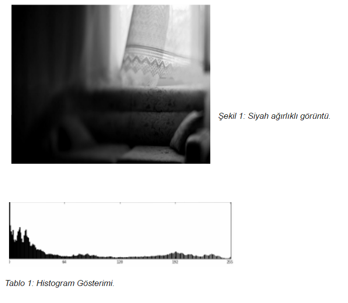

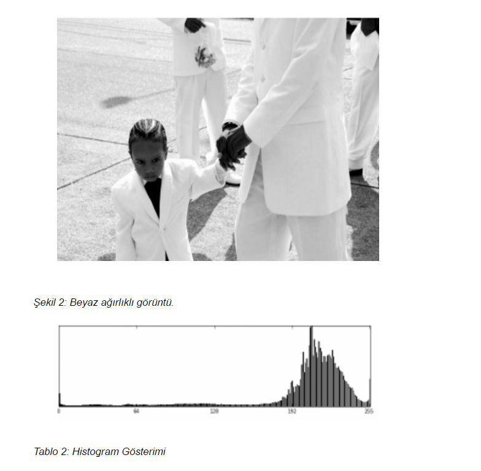

Tabloların yatay ekseni gri değer aralıklarını düşey eksenler ise bu aralıklardaki piksel sayısını göstermektedir. 

=== 7.2)Histogram Dengeleme

Bir görüntüdeki renk değerlerinin belli bir yerde kümelenmiş olmasından kaynaklanan, renk dağılımı bozukluğunu gidermek için kullanılan bir yöntemdir. 
Histogram matematiksel olarak aşağıdaki şekilde gösterilebilir.
→h(rk )=nk 

rk : k’nıncı parlaklık değeri 
nk : k nıncı parlaklık değerinin görüntüdeki sayısı

image::15.png[r15]

8-bit parlaklıklı görüntüde 256 gri seviye vardır. Örnek olarak tüm değerler ilk 100 değerde toplanırsa renkleri fark etmek zorlaşmaktadır. +
Dönüştürülmüş ve orjinal olan histogramlar grafiklerde görüldüğü üzere olasılık yoğnluğu olarakta gösterilebilmektedir. +

image::16.png[r16]

Görüntü histogramı incelendiğinde ani artışlar ton grup aralıkları olarak ifade edilebilmektedir. Görüntüde var olabilen bu kısımlar gölge olarak belirlenerek gerekli işlemler yapılabilmektedir. +

Sayısal görüntü işlemede en basit ve en çok kullanılan araçlardan birisi gri seviyesi histogramıdır. Bu fonksiyon  görüntünün gri seviyesi içeriği hakkında bilgiler elde edilmesini sağlar. Histogramdan elde edilebilecek bazı bilgiler: +

* Koyu bir görüntünün histogram grafiğinin düşük gri seviye bölgesine yığılacağı açıktır.

* Parlak (Açık renk) düzgün bir görüntünün histogram grafiğinin büyük gri seviye bölgesine yığılacağı açıktır.

* Eğer histogram bir bölgeye yığılmış ise ( yani gri sviye ekseninin belirli bir bölgesine) bu görüntünün kontrastı kötüdür denir.

* İyi kontraslı bir resmin histogram grafiği tüm gri seviye değerlerine eşit yayılmış olduğunu açıklar.

Görüntüdeki gölgenin yumuşatılması için gerçekleştirilecek işlemler bu işlemlerle benzerlik göstermektedir. Yani  gölge olarak belirlenen bölgenin yani piksellerin renk değerlerinin görüntünün geneline uyarlanmasıdır.

=== 7.3) Histogram Eşitleme

İdeal olarak Histogram eşitleme; Giriş histogramını, her gri seviyesinde eşit piksel sayısına sahip bir histograma dönüştürme işlemi gibi düşünülebilir. Bu pratikte mümkün değildir. Bu yöntem histogramı dar olan resimler ya da resim içindeki bölgeler için daha iyi sonuç verir. Yani Histogram eşitleme renk değerleri düzgün dağılımlı olmayan resimler için uygun bir görüntü iyileştirme metodudur. Resmin tümüne uygulanabileceği gibi sadece belli bir bölgesine de uygulanabilir. Tüm resme uygulanırsa global histogram eşitleme, resmin belli bir bölgesine uygulandığında ise lokal histogram eşitleme adını alır. +

Histogram eşitlemenin özeti olarak; +

image::15.png[r3]

Bu formülü uygulama adımlarına dökecek olursak; +
. Resmin histogramı bulunur (her gri seviye için piksel sayısı grafiği).

. Histogramdan yararlanılarak kümülatif histogram bulunur. Kümülatif histogram, histogramın her değerinin kendisinden öncekiler ve kendisinin toplamı ile elde edilen değerleri içeren büyüklüktür. 

. Kümülatif histogram değerleri normalize edilip (toplam piksel sayısına bölünerek), yeni resimde olmasını istediğimiz max. renk değerleri ile çarpılır, çıkan değer tam sayıya yuvarlatılır. Böylelikle yeni gri seviye değerleri elde edilmiş olur.

 . Eski (Orijinal) gri seviye değerleri ile; 3.adımda elde edilen gri seviye değerleri biribirine karşılık düşürülür ve yeni histogram grafiği çizilir.

*n*: giriş görüntüsündeki toplam piksel sayısı (n0+n1+…….+nL-1 = n) +
*nj (nk )*: j. gri seviyedeki piksel sayısı +
*L*: mümkün olan (veya istenilen) toplam gri seviye sayısı( 8 bit renk derinliğinde 255 v.b) +
*sk* : Daha iyi kontraslı bir görüntü elde etmek için gri seviye dönüşüm değeri. +
Amaç; imgedeki düşük görünürlüğü iyileştirmektir. +

=== 7.4) Python ile Histogram Dengelemenin Görüntüye Uygulanması

[source,python]
---------------------------------------------------------------------
import numpy as np      

#numpy kütüphanesi eklenmiştir.

import pylab as plt     

# Ekrana grafik olarak çizdirmemizi sağlayacak pylab kütüphanesinden plt modülü eklenmiştir.

import matplotlib.image as mpimg   

#Görüntünün çok yönlü numpy dizisi olarak alınmasını sağlayacağımız mpimg modülü eklenmiştir.

def imhist(im):         

#imhist fonksiyonu ile parametre olarak gönderilen görüntünün renk histogramı hesaplanır.

    m, n = im.shape    
    
    #Görüntünün numpy dizisi olarak boyutu m,n değişkenlerine atanır.
    
    h = [0.0] * 256     
    
    #Histogram değerlerini tutacak h adında 256 elemanlık bir matris tanımlanır.
    
    for i in range(m):      
    
    #Görüntünün boyutu değerince oluşturulan iç içe döngüler ile görüntü üzerinde dolaşılır.
    
        for j in range(n):
            h[im[i, j]]+=1      
            
            #Görüntünün tüm piksel değerleri için histogram bir arttırılarak histogram matrisi bulunur.
            
    return np.array(h)/(m*n)        
    
    #Bulunan histogram değerleri numpy dizisine dönüştürülür ve görüntünün büyüklüğüne bölünür. Böylece ilk adım olan renk aralıklarını toplam boyuta bölerek renk frekansları bulma işlemi gerçekleştirilir.

def cumsum(h):      

#Kümülatif olarak tüm histogram değerleri toplanır.

    return [sum(h[:i+1]) for i in range(len(h))]

def histeq(im):     

#Histogram eşitleme işlemini yapacağımız fonksiyonumuz resim parametresi ile çalışmaktadır.

    h = imhist(im)      
    
    #Gelen resmin histogram tablosu çıkarılır.
    
    cdf = np.array(cumsum(h))       
    
    #Kümülatif dağılım fonksiyonu hesaplanır ve numpy dizisine dönüştürülür.
    
    sk = np.uint8(255 * cdf)    
    
    #Kümülatif dağılım fonksiyonu değerleri kullanılarak görüntünün değerleri 0-255 arasına çekilir yani normalize bir gri değer elde edilir.
    s1, s2 = im.shape      
    
    #Görüntünün boyutları alınır.
    
    new_im = np.zeros_like(im)       
    
    #Yeni görüntü için 0'lık bir np dizisi oluşturulmuştur.
    
    for i in range(0, s1):      
    
    #Görüntü boyutu değerince iç içe döngü oluşturulur.
    
        for j in range(0, s2):
            new_im[i, j] = sk[im[i, j]]     
            
            #Görüntüden alınan piksel değerleri ile Kümülatif dağılım fonksiyonundan aldığımız değerleri eşleyerek yeni görüntünün piksel değerlerini elde ediyoruz.
            
    return new_im       
    
    #Elde edilen görüntü geri gönderilir.
    

img = np.uint8(mpimg.imread('image.png')*255.0)    

#İlk olarak png formatındaki görüntümüzü matris biçiminde 0-255 değerleri arasına indirgeyerek matris olarak okuyoruz.#Okuduğumuz görüntüyü griye çevirme işlemi için kullanılan katsayılar ile çarparak görüntüyü griye çeviriyoruz.Ve çevirme işleminden sonra görüntü tekrar normalize olarak 0-255 değerleri arasına çekilir.

img = np.uint8((0.2126* img[:,:,0]) + \
          np.uint8(0.7152 * img[:,:,1]) +\
             np.uint8(0.0722 * img[:,:,2]))

new_img = histeq(img)      

#Görüntüyü histeq fonksiyonuna göndererek histogramları eşitlenmiş halini elde ediyoruz. 

#Son olarak bu görüntüleri ekrana çizdiriyoruz.

plt.subplot(121)        

#plt modülünden subplot fonksiyonu ile görüntünün durması gereken noktayı seçiyoruz.

plt.imshow(img)         

#imshow ile çizdirilecek görüntü gösterilir.

plt.title('Orjinal Resim')      

#Yazılacak olan başlık belirlenir.

plt.set_cmap('gray')        

#Görüntülerin gri düzeyinde gösterilmesini sağlar.

plt.subplot(122)
plt.imshow(new_img)
plt.title('Histogram Esikleme Yapilan Resim')
plt.set_cmap('gray')
plt.show()

---------------------------------------------------------------------

